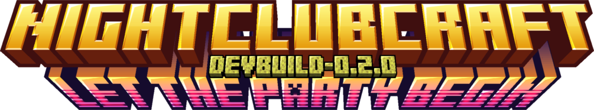

<div align="center">



[](https://github.com/ivnovomi/nightclubcraft)
[](https://minecraft.net)
[](https://fabricmc.net)
[](https://opensource.org/licenses/MIT)
[](https://github.com/ivnovomi/nightclubcraft)

**Transform your Minecraft world into the ultimate nightlife experience**

[Features](#-key-features) • 
[Progression](#-game-progression) •
[Installation](#-installation) • 
[Getting Started](#-getting-started) • 
[Development](#-development) • 
[Roadmap](#-roadmap) • 
[License](#-license)


</div>

> ### ⚠️ **EARLY DEVELOPMENT DISCLAIMER**
> 
> **NightClubCraft is currently in very early development (pre-alpha).** Many features described in this README are planned or in progress, but not yet fully implemented. The current version serves as a foundation for what will become a comprehensive nightlife management experience. Expect frequent updates, changes, and improvements as we work toward our vision.

## 🌃 Overview

**NightClubCraft** isn't just another Minecraft mod—it's a complete transformation of the game. This mod fuses Minecraft's classic essence with innovative nightlife management mechanics, turning the block world into a vibrant nightclub empire simulator. Design, build, and manage your own nightclubs, attract customers, host events, and become the ultimate nightlife mogul in the Minecraft universe.

> "The night belongs to those who can transform blocks into beats."

## 🌟 Game Progression

In NightClubCraft, your journey from unknown entrepreneur to nightlife legend follows a compelling progression path:

### 🏙️ From Humble Beginnings
- **Start in the Big City**: Begin your adventure in a sprawling metropolis with limited resources
- **Your First Dive Bar**: Transform a small, run-down space into your first establishment
- **Build a Reputation**: Attract your first regular customers and establish your brand
- **Financial Struggles**: Balance tight budgets, loans, and investments to stay afloat

### 📈 Business Expansion
- **Venue Upgrades**: Renovate and expand your original location as profits increase
- **Location Scouting**: Find prime real estate for your next venue
- **Diversification**: Open different types of establishments (cocktail lounges, dance clubs, rooftop bars)
- **Staff Development**: Build a loyal team and develop their skills
- **First Partnerships**: Secure initial deals with local beverage suppliers and brands
- **Marketing Reach**: Expand your promotional efforts beyond the immediate neighborhood

### 🌆 Building an Empire
- **Multiple Venues**: Manage a network of clubs across different districts
- **Brand Recognition**: Develop a distinctive style that makes your clubs instantly recognizable
- **Celebrity Connections**: Attract famous DJs, performers, and VIP guests
- **Industry Influence**: Shape nightlife trends and set the standard for entertainment
- **Major Sponsorships**: Negotiate lucrative deals with national and international brands
- **Exclusive Contracts**: Secure rights to be the sole provider of certain premium products

### 🏆 Reaching the Top
- **International Expansion**: Open clubs in different cities or even countries
- **Festival Ownership**: Create and manage your own music festivals
- **Media Empire**: Launch record labels, streaming platforms, or entertainment networks
- **Legacy Building**: Train the next generation of nightlife entrepreneurs

## 📱 Social Media & Networking

NightClubCraft features a comprehensive in-game social media system that mirrors real-world digital marketing:

- **Platform Variety**: Manage profiles on different types of social networks (photo-sharing, short videos, professional networking)
- **Content Creation**: Design posts, stories, and campaigns to promote your venues
- **Follower Growth**: Build your audience and track engagement metrics
- **Influencer Partnerships**: Collaborate with in-game celebrities and influencers
- **Trend Surfing**: Capitalize on viral trends to boost your visibility
- **Crisis Management**: Handle negative reviews and PR disasters
- **Community Building**: Create loyal fan communities around your brand
- **Analytics Dashboard**: Track performance metrics and optimize your strategy

## 🎧 Music System & DJ Experience

The heart of any great nightclub is its music, and NightClubCraft offers unprecedented flexibility in how you soundtrack your venues:

### 🎵 Dual Music Sources

**1. Integrated Music Library**
- **Streaming Integration**: Access thousands of tracks from Soundcloud and Beatport directly in-game
- **Curated Playlists**: Browse genre-specific collections created by real DJs
- **Default Game Tracks**: Use the 50+ original tracks included with the mod
- **Trending Charts**: Stay updated with the latest hits across different genres
- **Mood-Based Selection**: Choose music based on the atmosphere you want to create

**2. Personal Music Import**
- **Local Files**: Import MP3, WAV, FLAC, and other audio formats from your computer
- **Custom Organization**: Create folders and playlists to organize your music collection
- **Metadata Support**: The game reads and displays artist, title, and album information
- **Visualizer Generation**: Automatic creation of visualizers based on your music's characteristics
- **Seamless Integration**: Your imported music works with all in-game DJ equipment and effects

### 🎚️ DJ Tools & Features

- **Professional Equipment**: Virtual CDJs, mixers, controllers, and turntables with realistic functionality
- **Live Mixing**: Beatmatch, crossfade, loop, and apply effects in real-time
- **Advanced Effects**: Apply filters, echoes, reverbs, and other audio effects
- **Recording**: Capture your mixes to share with other players or export for external use
- **DJ Reputation**: Build your fame as a DJ with successful sets and performances
- **Guest DJs**: Hire NPC DJs with different styles and skills, or invite other players to perform

### 🔊 Music Management

- **Licensing System**: Realistic simulation of music rights and royalties
- **Genre Impact**: Different music styles attract different clientele
- **Schedule Programming**: Set up automatic playlists for different times of the night
- **Volume Zoning**: Create areas with different music volumes and styles
- **Crowd Response**: NPCs react dynamically to music changes, showing excitement for popular tracks
- **Special Requests**: Handle song requests from VIP guests

## ✨ Key Features

### 🏗️ Advanced Building & Engineering Systems
- **Specialized Building Blocks**: Neon lights, dance floors, bars, DJ booths, and more
- **Realistic Wiring Simulation**: Create complex electrical systems with power management
- **Structural Integrity**: Buildings that respond to physics and require proper support
- **Design Freedom**: Express your creativity with unique architectural elements

### 🎵 Dynamic Music & Audio System
- **Custom Playlists**: Import and organize your favorite tracks
- **DJ Controls**: Mix, fade, and control music in real-time
- **Sound Zones**: Create different audio experiences in various areas of your club
- **Audio Engineering**: Place speakers, manage acoustics, and control sound propagation
- **Dual Music Sources**:
  - **Integrated Music Library**: Access tracks from Soundcloud, Beatport, or use the default game tracks
  - **Personal Music Import**: Load and play your own music files directly in the game
- **Music Licensing System**: Realistic simulation of music rights and royalties
- **Crowd Response**: NPCs react differently to various music genres and tracks

### 👥 Advanced NPC & Social Systems
- **Realistic Customer Behavior**: NPCs with personalities, preferences, and social dynamics
- **Interactive Dialogue System**: Engage with customers and staff through branching conversations
- **Staff Management**: Hire bartenders, security, and DJs with unique skills and personalities
- **VIP Guests**: Attract special characters with exclusive perks and demands
- **Relationship Building**: Develop connections with recurring customers and local celebrities

### 💰 Economic & Business Simulation
- **Revenue Streams**: Ticket sales, drinks, VIP services, and more
- **Business Management**: Balance expenses, staff salaries, and upgrades
- **Reputation System**: Build your club's fame to attract more customers
- **Marketing Campaigns**: Design and launch promotional events to increase visibility
- **Competition**: Deal with rival clubs and changing market conditions
- **Brand Partnerships**: Negotiate deals with beverage companies, fashion brands, and more
- **Sponsorship Management**: Attract sponsors for events and secure exclusive contracts
- **Product Placement**: Feature branded products in your venues for additional revenue

### 🎮 Interactive Elements & Animations
- **Minigames**: Keep your customers entertained with various activities
- **Custom Animations**: Realistic character movements, dancing, and interactions
- **Event Planning**: Design and execute special themed nights
- **Real-time Feedback**: Monitor customer satisfaction and adapt
- **Dynamic Crowd Behavior**: Crowds that respond to music, lighting, and atmosphere

### 🎪 Festival & Event Management
- **Large-Scale Events**: Organize and manage multi-day festivals
- **Stage Construction**: Build and customize performance stages
- **Artist Booking**: Negotiate with performers and create lineups
- **Logistics Management**: Handle security, facilities, and crowd flow
- **Weather Effects**: Deal with changing conditions that affect outdoor events

### 🔌 Technical Infrastructure
- **Power Grid Management**: Generate and distribute electricity to your venues
- **Water & Waste Systems**: Manage resources and environmental impact
- **Network Infrastructure**: Set up security cameras, communication systems, and more
- **Transportation**: Provide access to your venues through various transportation options
- **Emergency Systems**: Fire safety, evacuation plans, and security protocols

### 🌐 Urban Integration & City Life
- **District Dynamics**: Different city areas with unique characteristics and clientele
- **Local Regulations**: Navigate permits, licenses, and city ordinances
- **Neighborhood Relations**: Manage noise complaints and community impact
- **Public Transportation**: Ensure customers can reach your venues easily
- **City Events**: Participate in and sponsor citywide celebrations and festivals

### 🤝 Brand Partnerships & Sponsorships

- **Beverage Deals**: Negotiate with drink companies for exclusive pouring rights
- **Brand Representation**: Choose between mainstream and boutique brands for your venues
- **Exclusivity Contracts**: Secure higher payments by offering exclusive brand presence
- **Promotional Events**: Host brand launch parties and sponsored nights
- **Celebrity Endorsements**: Partner with in-game celebrities to promote products
- **Cross-Promotion**: Create co-branded marketing campaigns with fashion, technology, and lifestyle brands
- **Sponsorship Tiers**: Manage different levels of sponsorship with varying benefits and requirements
- **Contract Negotiation**: Balance financial benefits against brand alignment and customer preferences
- **Product Integration**: Incorporate branded items into your venue's design and offerings
- **Sponsor Relations**: Maintain positive relationships with sponsors through performance reports and VIP treatment

## 🔧 Installation

### Requirements
- Minecraft: 1.20.1
- Fabric Loader: 0.16.10 or higher
- Fabric API: 0.92.3+1.20.1 or higher

### Recommended Mods
- [ModMenu](https://www.curseforge.com/minecraft/mc-mods/modmenu): Provides a user-friendly interface to access NightClubCraft settings and developer tools

### Quick Install
1. Install [Fabric Loader](https://fabricmc.net/use/)
2. Download [Fabric API](https://www.curseforge.com/minecraft/mc-mods/fabric-api) and place it in your `mods` folder
3. Download [ModMenu](https://www.curseforge.com/minecraft/mc-mods/modmenu) (recommended) and place it in your `mods` folder
4. Download NightClubCraft and add it to your `mods` folder
5. Launch Minecraft and start building your nightlife empire!

## 🚀 Getting Started

### First Steps
1. **Create a New World**: Use our custom world creation screen for the optimal experience
2. **Find the Perfect Location**: Choose a spot with enough space for your club
3. **Gather Resources**: Collect the materials needed for your first club

### Building Your First Club
1. **Basic Structure**: Start with walls, floors, and a basic layout
2. **Essential Equipment**: Place speakers, lights, and a bar
3. **Staff Setup**: Hire your first employees to run the club

### Managing Your Business
1. **Set Prices**: Configure entry fees and drink prices
2. **Marketing**: Attract your first customers
3. **Expand**: Reinvest profits to grow your nightlife empire

## 💡 Tips & Tricks

<details>
<summary><b>Club Design</b></summary>
<ul>
<li>Use different colored lights to create distinct zones</li>
<li>Place speakers strategically for optimal sound distribution</li>
<li>Create multiple floors for different experiences</li>
<li>Consider traffic flow when designing entrances and exits</li>
<li>Balance aesthetic appeal with functional requirements</li>
</ul>
</details>

<details>
<summary><b>Business Management</b></summary>
<ul>
<li>Balance ticket prices with drink costs</li>
<li>Invest in staff training for better service</li>
<li>Monitor customer feedback to improve your club</li>
<li>Adjust pricing based on day of the week and special events</li>
<li>Create loyalty programs to encourage repeat customers</li>
</ul>
</details>

<details>
<summary><b>Event Planning</b></summary>
<ul>
<li>Theme nights attract specific customer types</li>
<li>Special events can boost your reputation significantly</li>
<li>Collaborate with other players for bigger events</li>
<li>Plan seasonal events to keep your calendar fresh</li>
<li>Balance event frequency to maintain exclusivity</li>
</ul>
</details>

<details>
<summary><b>Technical Setup</b></summary>
<ul>
<li>Plan your electrical wiring before building</li>
<li>Create redundant power systems for critical equipment</li>
<li>Use cable management to keep your setup organized</li>
<li>Test sound systems thoroughly before opening</li>
<li>Implement proper security measures at all entrances</li>
</ul>
</details>

<details>
<summary><b>Social Media Strategy</b></summary>
<ul>
<li>Post regularly to maintain visibility</li>
<li>Use high-quality images of your venue's best features</li>
<li>Create event hashtags to track engagement</li>
<li>Respond to comments and reviews promptly</li>
<li>Collaborate with other players for cross-promotion</li>
</ul>
</details>

<details>
<summary><b>Music Management</b></summary>
<ul>
<li>Match music genres to your target clientele</li>
<li>Create different playlists for different times of the night</li>
<li>When using personal music, organize tracks by BPM for easier DJ transitions</li>
<li>Invest in higher quality speakers for VIP areas</li>
<li>Use the in-game equalizer to optimize sound for different room sizes</li>
<li>Consider licensing costs when selecting music for larger venues</li>
</ul>
</details>

<details>
<summary><b>DJ Performance</b></summary>
<ul>
<li>Practice beatmatching with the tutorial system before live performances</li>
<li>Start with simpler transitions before attempting complex effects</li>
<li>Read the crowd's reaction to adjust your set in real-time</li>
<li>Build a signature sound to increase your DJ reputation</li>
<li>Record your best sets to use as promotional material</li>
<li>Collaborate with other player DJs for special back-to-back sets</li>
</ul>
</details>

<details>
<summary><b>Brand & Sponsorship Management</b></summary>
<ul>
<li>Start with local brands before approaching major corporations</li>
<li>Match brand partnerships with your club's theme and target audience</li>
<li>Read contracts carefully for exclusivity clauses that might limit future opportunities</li>
<li>Negotiate for promotional materials and not just financial compensation</li>
<li>Use brand partnerships to upgrade your venue's equipment at reduced costs</li>
<li>Balance mainstream brands with trendy boutique options to maintain credibility</li>
<li>Track the impact of brand deals on customer satisfaction and adjust accordingly</li>
</ul>
</details>

## 🛠️ Development

Want to contribute to NightClubCraft? We welcome developers who share our passion for nightlife and Minecraft!

```bash
# Clone the repository
git clone https://github.com/ivnovomi/nightclubcraft.git

# Setup development environment
./gradlew genSources

# Build the mod
./gradlew build

# Run client
./gradlew runClient
```

### Development Tools
- Our custom DevTools screen helps you test features quickly
- Comprehensive documentation available in the `/docs` folder
- Active developer community on Discord

## 📋 Roadmap

### Currently Implementing
- **Core Building System**: Foundation for specialized nightclub blocks
- **Basic Music Controls**: Initial implementation of music playback
- **Simple NPC Behaviors**: First iteration of customer AI
- **UI Framework**: Groundwork for management interfaces
- **Music Library Framework**: Basic structure for music management system

### Coming Soon
- **Advanced Light Show Editor**: Create synchronized light performances
- **DJ Mixing System**: Real-time audio controls and effects
- **Club Reputation System**: Build fame and attract VIP guests
- **Staff Skill Trees**: Develop your employees' abilities
- **Multiplayer Events**: Collaborate with friends on massive parties
- **Dialogue System**: Interactive conversations with NPCs
- **Animation Framework**: Custom character movements and interactions
- **Social Media System**: In-game platforms for marketing and networking
- **Music Integration**: Soundcloud and Beatport API connections
- **Local Music Import**: System for loading personal music files
- **Brand Partnership Framework**: Basic system for in-game brand deals

### Future Vision
- **Mobile App Integration**: Manage your club on the go
- **Custom Music Import**: Add your own tracks to the game
- **Seasonal Events**: Special holiday-themed content
- **Club Competitions**: Compete with other players for nightlife dominance
- **Economy Expansion**: Stock market, investments, and more
- **Festival Management**: Tools for organizing large-scale events
- **Weather Effects**: Dynamic conditions affecting outdoor venues
- **City Integration**: Become part of a larger urban ecosystem
- **Career Progression**: Rise from small bar owner to nightlife tycoon
- **Advanced DJ Tools**: Professional-grade virtual equipment
- **Music Licensing System**: Realistic music rights management
- **Audio Visualization**: Dynamic visual effects that respond to music
- **Corporate Sponsorship System**: Advanced brand integration and exclusive contracts
- **Product Placement Engine**: Realistic integration of branded products in your venues

## 📝 License

NightClubCraft is distributed under the **MIT License**. See the `LICENSE` file for more details.

## 👥 Credits

- **Lead Developer**: ivnovomi
- **Art & Design**: ivnovomi
- **Music & Sound**: ivnovomi
- **Special Thanks**: The Fabric community and all our contributors

## 🔗 Links

<div align="center">

[](https://discord.gg/yourserver)
[](https://github.com/ivnovomi/nightclubcraft)
[](https://twitter.com/yourusername)

</div>

---

<div align="center">


**NightClubCraft** — Redefining Minecraft nightlife, one beat at a time.
</div>